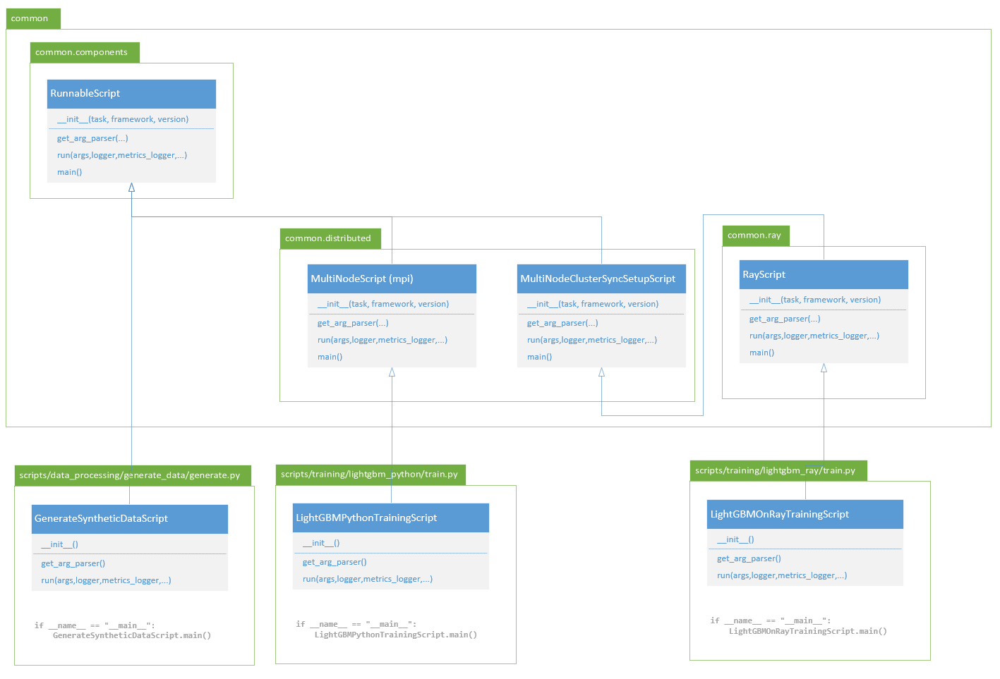
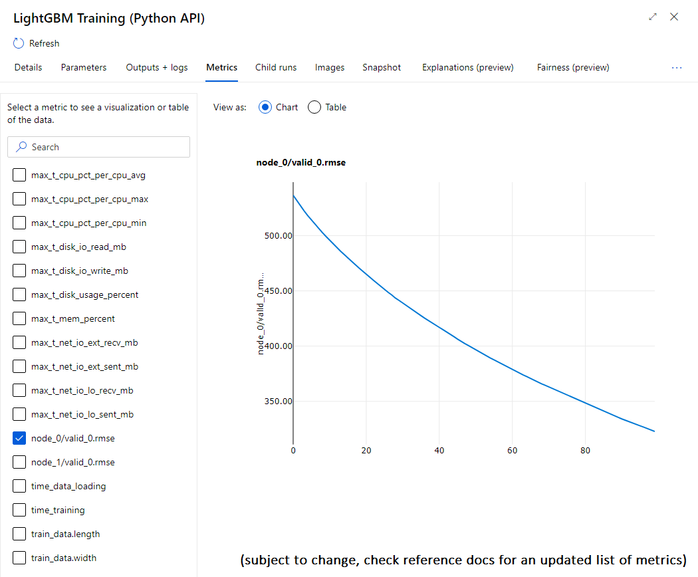

# Architecture of benchmark scripts

The benchmark repo follows an architecture where:

- All scripts must run both locally and in AzureML.
- All scripts should follow a standard reporting framework.
- Code duplication should be kept minimal.

To achieve that, we're based our code on an object oriented architecture. The following document provides a walkthrough of that architecture to help you locate where you can contribute.

## 1. Structure of the repository

| Directory | Content |
| :-- | :-- |
| `/.github/workflows/` | [github workflows](https://docs.github.com/en/actions/reference/workflow-syntax-for-github-actions) for this project |
| `/conf/` | Configuration files for pipelines and experiments running in AzureML. |
| `/data/` | Use to create local outputs, or find local data. This directory is in `.gitignore` to avoid pushing data in git. |
| `/docker/` | Example environments to run some of the modules (ex: multiple containers for different versions of lightgbm). |
| `/docs/` | Documentation in markdown |
| `/src/` | &nbsp; |
| `/src/binaries/` | C++ code for some binaries used in the benchmark (ex: lightgbm C API inferencing). |
| `/src/common/` | Common libraries for all benchmark scripts |
| `/src/pipelines/` | Scripts or config files for running the benchmark in AzureML. |
| `/src/scripts/` | Benchmark scripts |
| `/tests/` | Unit tests using pytest |

 
## 2. Architecture of runnable scripts in `src/scripts/`

Every script under `src/scripts/` can be run manually. **Each runnable script inherits from `RunnableScript` helper class.** These classes provides all the standard reporting features, and contains the code that would otherwise be duplicated.

### 2.1. There's a helper class for each implementation scenario

The benchmark `src/common/` folder contains multiple "helper classes" that all derive from `RunnableScript`, and cover some typical implementation scenarios: single node, multi node using mpi, multi node using Ray, and others (TBD).



Each script will always have at least the following methods:
- `__init__()`: this will just call the super class `__init__(task, framework, version)` with the right arguments.
- `get_arg_parser()`: this populates an argument parser with the specific arguments of this script, and uses super class to populate generic arguments.
- `run(args, logger, metrics_logger, unknown_args)`: this is the "main" method of the script, the helper class will call it after initializing all resources, will take care of reporting exceptions and resource utilization while running, and will finalize resources upon return.

The arguments of the `run()` method provide the loggers needed by the script to report logs, or metrics, using our common mlflow helping methods.

The script doesn't have a specific `main()` method. Instead, they rely on the helper class `main()` method which will orchestrate script initialization and finalization.

### 2.2. Scripts rely on standard arguments

Each script is runnable locally. They will have multiple sets of arguments, some are specific to the script itself (ex: lightgbm number of trees), some others are generic to the implementation scenario (ex: which metric reporting scheme to use).

When you display usage of a script, for instance

```bash
python .\src\scripts\training\lightgbm_python\train.py -h
```

watch out for arguments groups showing which argument relates to which layer of the architecture.

For instance below (extract):

```
optional arguments:
  -h, --help            show this help message and exit

General parameters [common.components:RunnableScript]:
  --verbose VERBOSE     set True to show DEBUG logs
  --custom_properties CUSTOM_PROPERTIES
                        provide custom properties as json dict
  --disable_perf_metrics DISABLE_PERF_METRICS
                        disable performance metrics (default: False)
  --metrics_driver {mlflow,azureml}
                        which class to use to report metrics mlflow or
                        azureml

MultiNode runtime parameters [common.distributed:MultiNodeScript]:
  --multinode_driver {mpi,socket}
  --multinode_machines MULTINODE_MACHINES
                        list of machines, use only when running locally,
                        default will use 'auto' to discover
  --multinode_listen_port MULTINODE_LISTEN_PORT
                        used for socket only, default 12345

LightGBM learning parameters [__main__:LightGBMPythonMultiNodeTrainingScript]:
  --objective OBJECTIVE
  --metric METRIC
  --boosting_type BOOSTING_TYPE
  --tree_learner TREE_LEARNER
  --label_gain LABEL_GAIN
  --num_trees NUM_TREES
  --num_leaves NUM_LEAVES
  --min_data_in_leaf MIN_DATA_IN_LEAF
  --learning_rate LEARNING_RATE
  --max_bin MAX_BIN
  --feature_fraction FEATURE_FRACTION
  --device_type DEVICE_TYPE
  --custom_params CUSTOM_PARAMS
```

You'll notice 3 argument groups:
- **General parameters** derive from the class [`common.components:RunnableScript`]
- **MultiNode runtime parameters** derive from the class [`common.distributed:MultiNodeScript`]
- **LightGBM learning parameters** are the `__main__` arguments from this particular script.

### 2.3. All scripts report the same performance metrics

Thanks to the scripts using a common set of helper classes, they report a unified set of metrics for performance monitoring. You can find a [list of those metrics in the reference docs](../references/common/perf.md).

Those metrics are reported using mlflow. When running locally, you can use mlflow to query the values and artifacts reported by each script. When running in AzureML, those values will flow in the UI for you to browse.



## 3. Architecture of pipelines

WORK IN PROGRESS